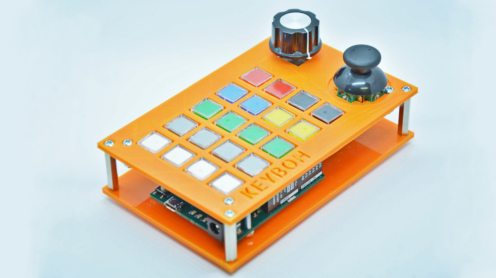

# KeyBoh

KeyBoh is an Arduino Leonardo shield for making customizable USB keyboards. We love to use the [NicoHood HID Project library](https://github.com/NicoHood/HID) for interfacing the whole thing to a Computer.

## Make a PCB  
Making the PCB on PCBWay will support our work! You need to subscribe to PCBWay first: you can do it using [this invite link](https://www.pcbway.com/setinvite.aspx?inviteid=355653&from=settorezero2020). Then you can let you make the [PCB on PCBWay using from the shared project page](https://www.pcbway.com/project/shareproject/KeyBoh_Shield.html)

## KeyBoh enclosure
In the [STL folder](./stl) are located the two panels you can 3Dprint by yourself. Then you can assemble the Keyboh as showed in the pictures using 4x 24mm F/F  and 4x M/F 6mm hex spacers + 12x M3 6mm screws and 4 3M bolts.

## Code examples
See in the [Arduino folder](./arduino) for code examples. We're currently working to a multi-predefined configurable keyset for various applications, so stay tuned.  

## Connection table
To do. In the meanwhile look at schematic in the [docs folder](./docs)

## Can I use keyboh with other boards?
Keyboh is designed for the Arduino Leonardo using his USB features for making USB devices you can use on the computer.

### Keyboh on Arduino UNO
Since the Leonardo has separate SDA and SCL lines while the UNO has SDA and SCL shared with A4 and A5, using the shield on the UNO will make not available I2C lines, or you may not use the joystick (that uses A4 and A5) freeing those two pins for using them for I2C.  
  
You can use Keyboh on the Arduino UNO if you want to control remote devices through the UART: you can connect an external device simply connecting the UART using wires or you can attach a Bluetooth or an XBee module, or an ESP8266 but be always aware of the voltage levels! There is the possibility to have a voltage divider only on the Arduino RX but connecting an ESP8266 requires a voltage divider on the TX.  

You can use Keyboh on the Arduino UNO also for USB communication using the [HoodLoader by NicoHood](https://github.com/NicoHood/HoodLoader2). This project is made for reprogramming the 16U2, used on the UNO as serial/USB bridge, and use it for USB custom purposes. We've still not used that feature so please read the documentation of this library.

### Keyboh on other boards
You can use the shield on other development boards connecting wires on pads: the silkscreen will help a lot.  
You can also saw off the PCB part with encoder and joystick: a part of soldering pads will be anyway available for reconnecting the two separate pcbs pads or for connecting them through wires.

## Warnings
Since keymatrix is implemented without protection diodes on pushbuttons, is no safe press more than 1 button on the same row at a time: this bring to a momentary short-circuit since 2 or more columns are connected together. Usually this is not a big problem since the duration of the short is very small due to column scan, but is better not doing this. In the next revision we'll add the protection diodes.

## Improvements
You can solder 2 small 10pF ceramic capacitors at place of `R3` and `R4` for improving the encoder response.

## Remarks for future PCB rev1
- Add protection diodes on keymatrix switches
- Add capacitor footprints for input filtering on encoder, joystick and keymatrix
- Use the Arduino micro instead of Leonardo (more compact) ?

## Links
- [more pictures of KeyBoh](https://photos.app.goo.gl/CL2jDvoLArWxuAqx8)

## Sharings
Since we love when others share our projects, here are linked pages who shared the project.  
Those links can be useful since people make also questions commenting on social posts and we try to give answers directly.

- [Arduino on IG](https://www.instagram.com/p/CIPJXs_j-tg/)
- [Arduino on TW](https://twitter.com/arduino/status/1333078330598363136)
- [Arduino on FB](https://www.facebook.com/official.arduino/posts/5567229216636685)
- [PCBWay on IG](https://www.instagram.com/p/CINa9Nnra6t/)
- [PCBWay on TW](https://twitter.com/PCBWayOfficial/status/1333344888537026561)
- [Microchip on IG](https://www.instagram.com/p/CIRuX1qnB_U/)
- [Microchip on TW](https://twitter.com/MicrochipMakes/status/1333442492117737475)
- [Microchip on FB](https://www.facebook.com/MicrochipMakes/posts/3820599841292022)
- [Hackster](https://www.hackster.io/news/keyboh-is-an-open-source-arduino-leonardo-shield-for-making-custom-usb-keyboards-208a930cc3f5)
